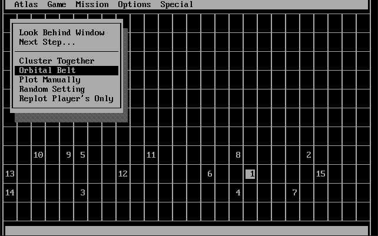

# qbasic-empire

> An unfinished QBASIC game from 1991-1992, now being finished after a momentary distraction. Feel free to contribute or do as you wish.

# controls

* Use the arrow keys to navigate dialog boxes.
* Use ^S, ^E, ^D and ^X to move windows.

# plans

Currently in step 1:

1. Setup open source.
2. Clean up code.
3. Get a basic game finished, even if not fun.
4. Plan a new game, one that is fun.
5. Tinker...

# history

Around 1991 I had a friend who greatly enjoyed a text-based, multi-player, space conquest game on the Apple IIe/IIgs. He disliked its automated battle mode, however, and asked me to write something better. I took the challenge but alas, never finished the game. I think his name was Matt or Garrity and this is dedicated to him. He said he was going to conquer the world but I'm glad he didn't because he planned on being a ruthless dictator.

# installation

This game is written in QBASIC. A copy of QBASIC.EXE is included in the repo in case you don't have the original MS-DOS media. However, the end of this document contains backup instructions for downloading a copy from the Internet Archive.

Assuming you no longer have a running copy of MS-DOS, you will need to run QBASIC.EXE under an MS-DOS emulator. DOSBox is recommended and can be downloaded for free from https://www.dosbox.com.

1. Clone the repo (if you want to contribute code), or just copy QBASIC.EXE, QBASIC.HLP (optional), and EMPIRE.BAS to a folder on your computer.

2. Start DOSBox.

3. In the DOSBox command prompt, type __MOUNT C C:\PATH\TO\FOLDER__ (specifying the path to the folder containing QBASIC and EMPIRE.BAS).
    
4. Type __C:__ to change to the C drive you just mounted.

5. Type __QBASIC EMPIRE__ to start QBASIC and load the program.

6. Press F5 to start.

# appendix: getting qbasic

In the past you could get QBASIC from Microsoft by downloading the Windows 95 CD-ROM Extras package. The package is no longer available but you can still get a cached copy from the Internet Archive:

* https://web.archive.org/web/20120215074213/http://download.microsoft.com/download/win95upg/tool_s/1.0/w95/en-us/olddos.exe

That link will download OLDDOS.EXE, which is a 16-bit MS-DOS self-extracting executable. Run it from the DOSBox command prompt to extract a variety of files into the current directory (run from DOSBox or your DOS emulator to avoid issues running 16-bit executables). You specifically need QBASIC.EXE and QBASIC.HLP (the other files can be deleted).